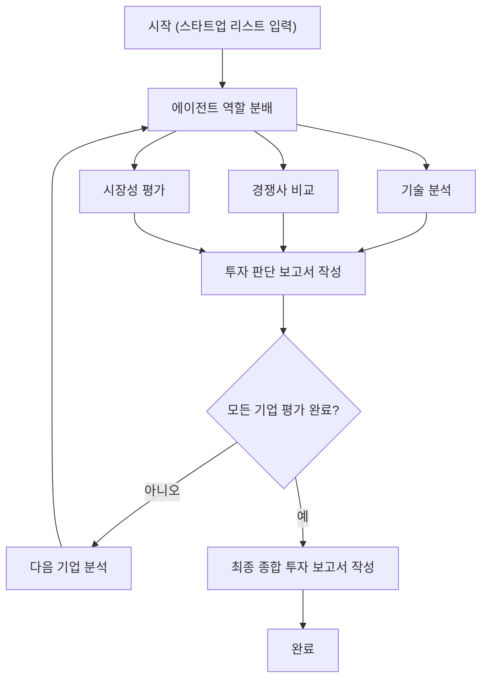

# AI Startup Investment Evaluation Agent

AI 스타트업에 대한 투자 평가 에이전트를 설계하고 구현한 실습 프로젝트

## Overview

- **Objective**: AI 스타트업의 기술력, 시장성, 경쟁력 등을 기준으로 투자 적합성 분석
- **Method**: LangGraph 기반 멀티 에이전트 구조 + Agentic RAG 적용
- **Tools**: Tavily API (웹 검색), OpenAI GPT API (텍스트 요약/분석), BeautifulSoup (콘텐츠 파싱)

## Features

- 웹 기반 시장/경쟁사 정보 검색 및 요약 (Tavily + GPT 기반)
- 스타트업 기술력 요약, 시장 분석, 경쟁사 비교 등 개별 평가 수행
- 모든 기업 분석 후 최종 보고서 자동 생성

## Tech Stack

| Category   | Details                 |
| ---------- | ----------------------- |
| Framework  | LangGraph, Python       |
| LLM        | OpenAI GPT-3.5-turbo    |
| Web Search | Tavily API              |
| Parser     | BeautifulSoup, Requests |

## Agents Overview

| 에이전트 이름             | 설명                                                               | 구현 현황 / 위치                         |
| ------------------------- | ------------------------------------------------------------------ | ---------------------------------------- |
| **DispatchAgent**         | 현재 평가 대상 스타트업을 모든 에이전트에게 전달하는 역할          | `InvestmentAgent.ipynb` (추후 분리 예정) |
| **TechReportAgent**       | 해당 스타트업의 핵심 기술력과 구현 가능성을 분석 (RAG 기반 가능)   | `agents/TechReportAgent.py`              |
| **MarketReportAgent**     | 시장 규모, 수요, 성장 가능성 등을 평가 (WebSearch 기반)            | `agents/MarketReportAgent.py`            |
| **CompetitorReportAgent** | 주요 경쟁사와의 비교를 통해 차별성 및 리스크 분석 (WebSearch 기반) | `agents/CompetitorReportAgent.py`        |
| **InvestmentAgent**       | 기술, 시장, 경쟁 분석 결과를 종합하여 투자 여부 판단               | `InvestmentAgent.ipynb` (추후 분리 예정) |
| **ReportWriterAgent**     | 개별 투자 판단 결과들을 종합하여 최종 투자 보고서 생성             | `InvestmentAgent.ipynb` (추후 분리 예정) |

## Architecture



## Directory Structure

```
 ┣ agents
 ┃ ┣ CompetitorReportAgent.py
 ┃ ┣ MarketReportAgent.py
 ┃ ┗ TechReportAgent.py
 ┣ data
 ┃ ┣ AIRS_MEDICAL
 ┃ ┃ ┗ AIRS_MEDICAL.pdf
 ┃ ┣ NOTA
 ┃ ┃ ┗ NOTA.pdf
 ┃ ┣ RIIID
 ┃ ┃ ┗ RIIID.pdf
 ┃ ┣ TWELVE_LABS
 ┃ ┃ ┗ TWELVE_LABS.pdf
 ┃ ┗ UPSTAGE
 ┃ ┃ ┗ UPSTAGE.pdf
 ┣ .gitignore
 ┣ InvestmentAgent.ipynb
 ┗ README.md
```

## Contributors

- 정누리 : 역할 분배 에이전트 구축, 투자 판단 에이전트 구축
- 김형섭 : 기술 요약 에이전트 구축
- 강성우 : 기술 요약 에이전트 구축
- 오현진 : 경쟁사 비교 에이전트 구축
- 이영진 : 시장성 평가 에이전트 구축
- 김민채 : 역할 분배 에이전트 구축, 보고서 작성 에이전트 구축
