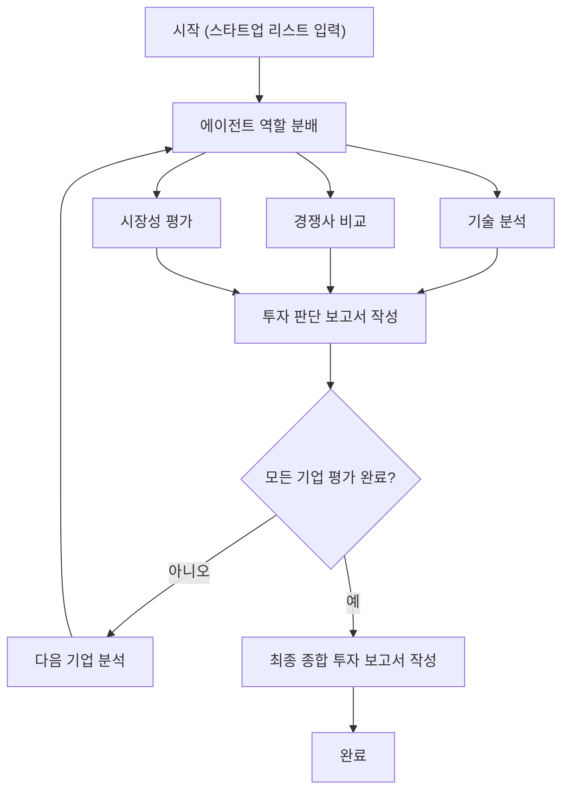

# AI Startup Investment Evaluation Agent

AI 스타트업에 대한 투자 평가 에이전트를 설계하고 구현한 실습 프로젝트

## Overview

- **목표**: AI 스타트업의 기술력, 시장성, 경쟁력 등을 기준으로 투자 적합성 분석
- **방법론**: LangGraph 기반 멀티 에이전트 구조 + Agentic RAG 적용
- **데이터 소스**: 특허 PDF, 웹 검색, 검색 기반 추출 요약, 내장 임베딩 기반 RAG
- **사용 도구**: Tavily API (웹 검색), OpenAI GPT API (텍스트 요약/분석), SBERT + ChromaDB (문서 임베딩)

## Features

- **시장성 평가 에이전트**
  - Tavily API 기반 검색 및 HTML 콘텐츠 추출
  - 키워드별 병렬 크롤링 + GPT 기반 요약
- **경쟁사 분석 에이전트**
  - TheVC 사이트에서 경쟁사 추출
  - 각 경쟁사의 전략/기술/시장 정보 요약 및 종합 비교
- **기술 분석 에이전트**
  - 스타트업별 특허 PDF 읽기 및 SBERT 임베딩
  - ChromaDB 기반 RAG 검색 + 하향식 GPT 요약 구조 적용
- **LangGraph를 통한 병렬 평가**
  - 기술/시장/경쟁사 에이전트를 병렬 실행하여 평가 시간 단축

## Tech Stack

| Category        | Details                           |
| --------------- | --------------------------------- |
| Framework       | LangGraph, Python                 |
| LLM             | OpenAI GPT-3.5-turbo              |
| Embedding Model | SBERT (all-MiniLM-L6-v2)          |
| Vector DB       | ChromaDB (PersistentClient)       |
| Web Search      | Tavily API                        |
| Parser          | BeautifulSoup, Requests           |
| Parallel        | ThreadPoolExecutor (for crawling) |

## Agents Overview

| 에이전트 이름             | 설명                                                                  | 구현 현황 / 위치                         |
| ------------------------- | --------------------------------------------------------------------- | ---------------------------------------- |
| **DispatchAgent**         | 현재 평가 대상 스타트업을 모든 에이전트에게 전달하는 역할             | `InvestmentAgent.ipynb` (추후 분리 예정) |
| **TechReportAgent**       | 해당 스타트업의 핵심 기술력과 구현 가능성을 분석 (Vector DB RAG 기반) | `agents/TechReportAgent.py`              |
| **MarketReportAgent**     | 시장 규모, 수요, 성장 가능성 등을 평가 (WebSearch 기반)               | `agents/MarketReportAgent.py`            |
| **CompetitorReportAgent** | 주요 경쟁사와의 비교를 통해 차별성 및 리스크 분석 (WebSearch 기반)    | `agents/CompetitorReportAgent.py`        |
| **InvestmentAgent**       | 기술, 시장, 경쟁 분석 결과를 종합하여 투자 여부 판단                  | `InvestmentAgent.ipynb` (추후 분리 예정) |
| **ReportWriterAgent**     | 개별 투자 판단 결과들을 종합하여 최종 투자 보고서 생성                | `InvestmentAgent.ipynb` (추후 분리 예정) |

## Architecture



## Directory Structure

```
 ┣ agents
 ┃ ┣ CompetitorReportAgent.py
 ┃ ┣ MarketReportAgent.py
 ┃ ┗ TechReportAgent.py
 ┣ data
 ┃ ┣ AIRS_MEDICAL
 ┃ ┃ ┗ AIRS_MEDICAL.pdf
 ┃ ┣ NOTA
 ┃ ┃ ┗ NOTA.pdf
 ┃ ┣ RIIID
 ┃ ┃ ┗ RIIID.pdf
 ┃ ┣ TWELVE_LABS
 ┃ ┃ ┗ TWELVE_LABS.pdf
 ┃ ┗ UPSTAGE
 ┃ ┃ ┗ UPSTAGE.pdf
 ┣ .gitignore
 ┣ InvestmentAgent.ipynb
 ┗ README.md
```

## Contributors

- 정누리 : 역할 분배 에이전트 구축, 투자 판단 에이전트 구축
- 김형섭 : 기술 요약 에이전트 구축
- 강성우 : 기술 요약 에이전트 구축
- 오현진 : 경쟁사 비교 에이전트 구축
- 이영진 : 시장성 평가 에이전트 구축
- 김민채 : 역할 분배 에이전트 구축, 보고서 작성 에이전트 구축
