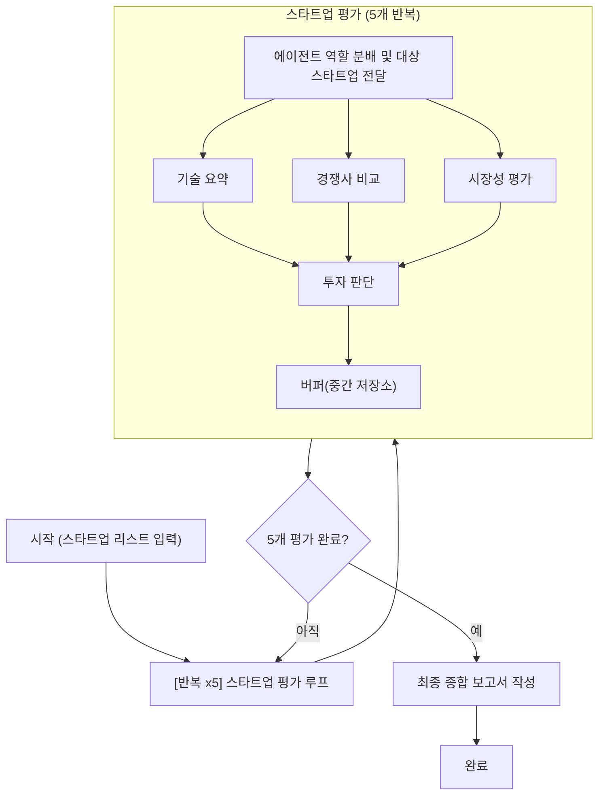

```mermaid
flowchart TB
  start["시작 (스타트업 리스트 입력)"] --> loopStart["[반복 x5] 스타트업 평가 루프"]

  subgraph 평가루프["스타트업 평가 (5개 반복)"]
    direction TB

    역할분배["에이전트 역할 분배 및 대상 스타트업 전달"]
    역할분배 --> 기술요약["기술 요약"]
    역할분배 --> 경쟁사비교["경쟁사 비교"]
    역할분배 --> 시장성평가["시장성 평가"]

    기술요약 --> 투자판단["투자 판단"]
    경쟁사비교 --> 투자판단
    시장성평가 --> 투자판단

    투자판단 --> 버퍼["버퍼(중간 저장소)"]
  end

  loopStart --> 평가루프
  평가루프 --> 반복종료확인{"5개 평가 완료?"}
  반복종료확인 -->|아직| loopStart
  반복종료확인 -->|예| 보고서작성["최종 종합 보고서 작성"]
  보고서작성 --> 완료["완료"]

```
